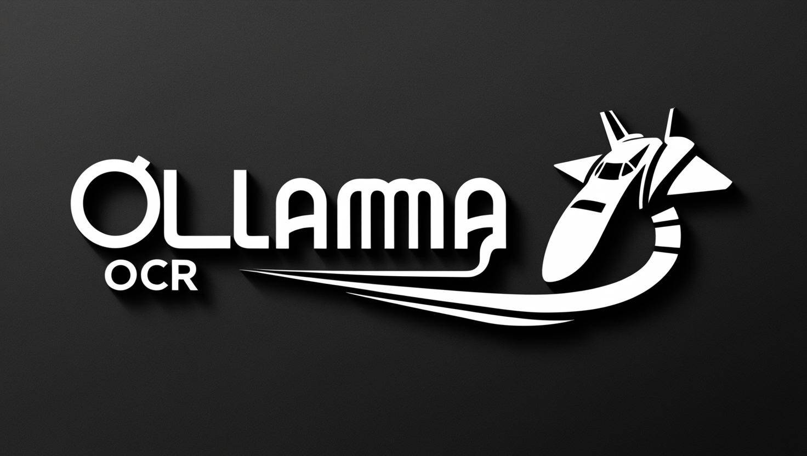
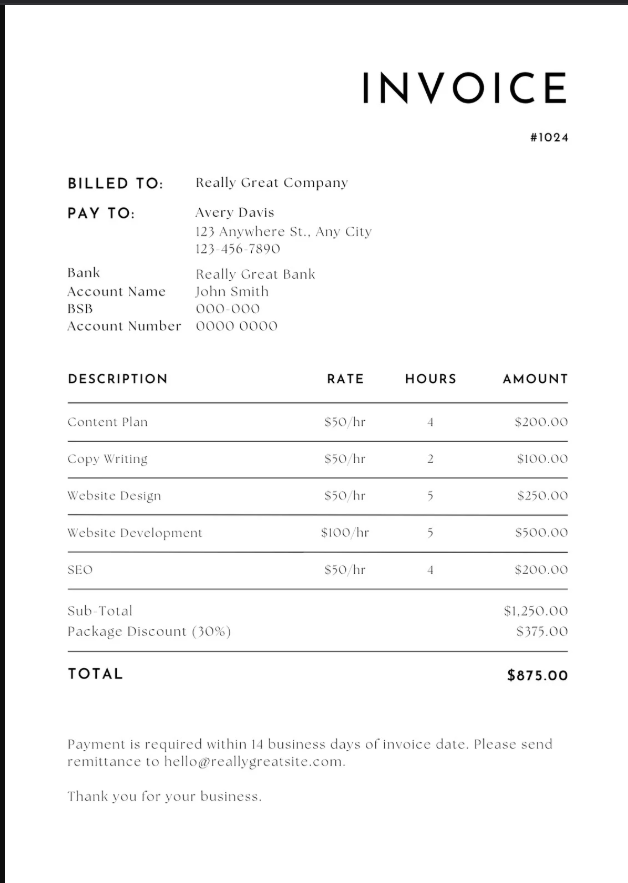
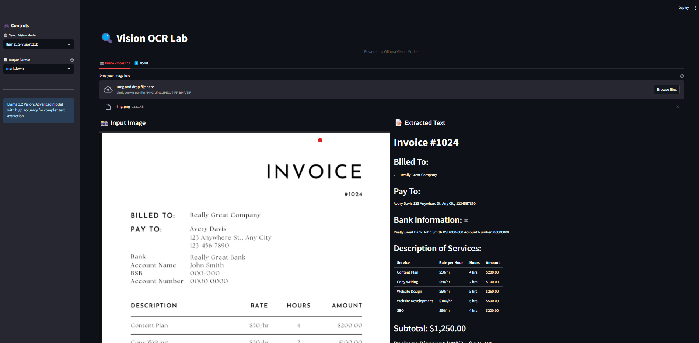
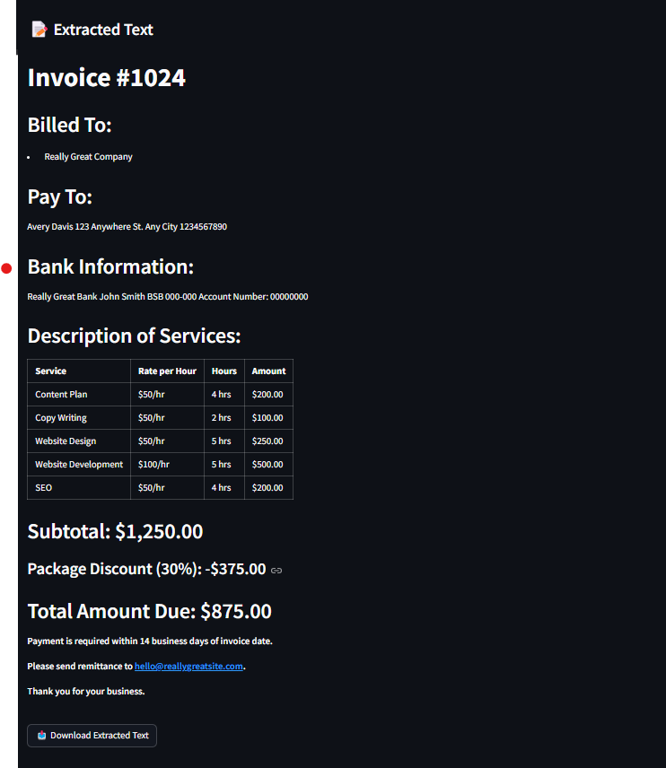

<a href="https://github.com/imanoop7/Ollama-OCR"></a>
<a href="https://github.com/imanoop7/Ollama-OCR/graphs/commit-activity"></a>
<a href="https://github.com/imanoop7/Ollama-OCR"></a>



<h1 align="center">Ollama OCR</h1>

A powerful OCR (Optical Character Recognition) package that uses state-of-the-art vision language models through Ollama to extract text from images and PDF. Available both as a Python package and a Streamlit web application.

## 🌟 Features

### Supports PDF and Images (New! 🆕)

- **Multiple Vision Models Support**
  - [LLaVA](https://ollama.com/library/llava): Efficient vision-language model for real-time processing (LLaVa model can generate wrong output sometimes)
  - Llama 3.2 Vision: Advanced model with high accuracy for complex documents
  - [Granite3.2-vision](https://ollama.com/library/granite3.2-vision): A compact and efficient vision-language model, specifically designed for visual document understanding, enabling automated content extraction from tables, charts,    infographics, plots, diagrams, and more.
  - [Moondream](https://ollama.com/library/moondream): Small vision language model designed to run efficiently on edge devices.
  - [Minicpm-v](https://ollama.com/library/minicpm-v): MiniCPM-V 2.6 can process images with any aspect ratio and up to 1.8 million pixels (e.g., 1344x1344).

- **Multiple Output Formats**
  - Markdown: Preserves text formatting with headers and lists
  - Plain Text: Clean, simple text extraction
  - JSON: Structured data format
  - Structured: Tables and organized data
  - Key-Value Pairs: Extracts labeled information
  - Table: Extract all tabular data.

- **Batch Processing**
  - Process multiple images in parallel
  - Progress tracking for each image
  - Image preprocessing (resize, normalize, etc.)

- **Custom Prompts**
  - Override default prompts with custom instructions for text extraction.

## 📦 Package Installation

```bash
pip install ollama-ocr
```

## 🚀 Quick Start
### Prerequisites
1. Install Ollama
2. Pull the required model:

```bash
ollama pull llama3.2-vision:11b
ollama pull granite3.2-vision
ollama pull moondream
ollama pull minicpm-v
```
## Using the Package

### Single File Processing

```python
from ollama_ocr import OCRProcessor

# Initialize OCR processor
ocr = OCRProcessor(model_name='llama3.2-vision:11b', base_url="http://host.docker.internal:11434/api/generate")  # You can use any vision model available on Ollama
# you can pass your custom ollama api

# Process an image
result = ocr.process_file(
    input_file_path="path/to/your/image.png", # path to your pdf files "path/to/your/file.pdf"
    format_type="markdown",  # Options: markdown, text, json, structured, key_value
    custom_prompt="Extract all text, focusing on dates and names.", # Optional custom prompt
    language="English" # Specify the language of the text (New! 🆕)
)
print(result)
```
### Batch File 

```python
from ollama_ocr import OCRProcessor

# Initialize OCR processor
ocr = OCRProcessor(model_name='llama3.2-vision:11b', max_workers=4)  # max workers for parallel processing

# Process multiple images
# Process multiple images with progress tracking
batch_results = ocr.process_batch(
    input_file_path="path/to/images/folder",  # Directory or list of image paths
    format_type="markdown",
    recursive=True,  # Search subdirectories
    preprocess=True,  # Enable image preprocessing
    custom_prompt="Extract all text, focusing on dates and names.", # Optional custom prompt
    language="English" # Specify the language of the text (New! 🆕)
)
# Access results
for file_path, text in batch_results['results'].items():
    print(f"\nFile: {file_path}")
    print(f"Extracted Text: {text}")

# View statistics
print("\nProcessing Statistics:")
print(f"Total images: {batch_results['statistics']['total']}")
print(f"Successfully processed: {batch_results['statistics']['successful']}")
print(f"Failed: {batch_results['statistics']['failed']}")
```

## 📋 Output Format Details

1. **Markdown Format**: The output is a markdown string containing the extracted text from the image.
2. **Text Format**: The output is a plain text string containing the extracted text from the image.
3. **JSON Format**: The output is a JSON object containing the extracted text from the image.
4. **Structured Format**: The output is a structured object containing the extracted text from the image.
5. **Key-Value Format**: The output is a dictionary containing the extracted text from the image.
6. **Table Format**: Extract all tabular data.

-----
## 🌐 Streamlit Web Application(supports batch processing)
- **User-Friendly Interface**
  - Drag-and-drop file upload
  - Real-time processing
  - Download extracted text
  - Image preview with details
  - Responsive design
  - Language Selection: Specify the language for better OCR accuracy. (New! 🆕)

1. Clone the repository:
```bash
git clone https://github.com/imanoop7/Ollama-OCR.git
cd Ollama-OCR
```
2. Install dependencies:
```bash
pip install -r requirements.txt
```
2. Go to the directory where app.py is located:
```bash
cd src/ollama_ocr      
```
3. Run the Streamlit app:
```bash
streamlit run app.py
```

## 📒 Example Notebooks 
- [Ollama OCR on Colab](example_notebooks\ollama_ocr_on_colab.ipynb): How to use Ollama-OCR on Google Colab.
- [Example Notebook](example_notebooks\example.ipynb): Example usage of Ollama OCR.
- [Ollama OCR with Autogen](example_notebooks\ollama-ocr-with-autogen.ipynb): Use Ollama-OCR with autogen.
- [Ollama OCR with LangGraph](example_notebooks\ollama-ocr-with-langgraph.ipynb): Use Ollama-OCR with LangGraph.


## Examples Output
### Input Image



### Sample Output




## 📄 License
This project is licensed under the MIT License - see the LICENSE file for details.

## 🙏 Acknowledgments
Built with Ollama
Powered by Vision Models


## Star History

<a href="https://www.star-history.com/#imanoop7/Ollama-OCR&Date">
 <picture>
   <source media="(prefers-color-scheme: dark)" srcset="https://api.star-history.com/svg?repos=imanoop7/Ollama-OCR&type=Date&theme=dark" />
   <source media="(prefers-color-scheme: light)" srcset="https://api.star-history.com/svg?repos=imanoop7/Ollama-OCR&type=Date" />
   
 </picture>
</a>

